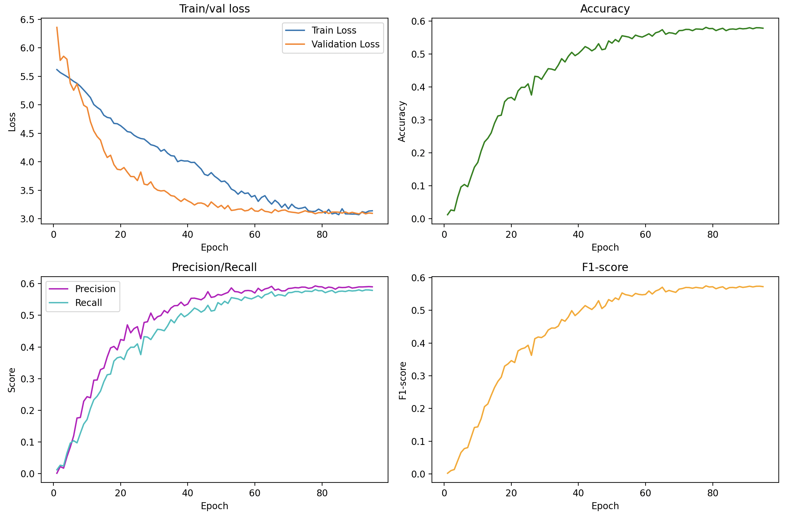

# ConvNeXt

PyTorch implementation of [A ConvNet for the 2020s](https://arxiv.org/pdf/2201.03545)

I implemented a pico version of ConvNeXt with 13.3M params. 
Implementation details:
- (3, 3, 9, 3) blocks per stage
- (64, 128, 256, 512) block dimensions
- Image size 224 x 224
- Batch size 64

---

## Caltech-256

The model was trained from scratch on the [Caltech-256](https://doi.org/10.22002/D1.20087) dataset with a 70-15-15 split.

Training was done for 100 epochs (though only 95 epochs are logged since 5 of them weren't saved oops).

---

## Results
|          | Top-1 Accuracy | Precision | Recall |
| -------- | -------------- | --------- | ------ |
| Val      | 57.9           | 59.0      | 57.9   |
| Test     | 59.3           | 60.5      | 59.3   |
